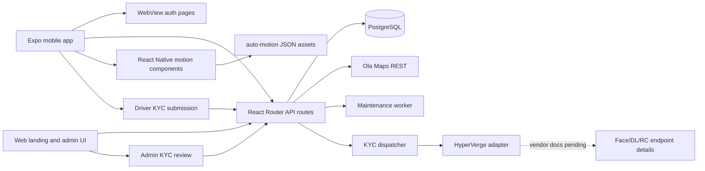

# TukTukGo Knowledge Map

Use this document as context for Claude, Codex, or another implementation agent. It describes the current repository shape, active architecture, verified backend behavior, and the next useful implementation areas.

## Project Identity

TukTukGo is an India-focused auto-rickshaw ride connection platform.

Core actors:
- Passenger: self-sign up, request rides, choose pickup/drop, adjust pickup on a map, cancel rides, view history.
- Driver: self-sign up, register vehicle/documents, complete KYC, wait for approval, toggle online, accept nearby rides, complete rides.
- Admin: review drivers, inspect ride/admin stats, manage subscription eligibility, and review KYC submissions. Admins approve driver applications; they do not need to create driver login accounts.

Primary stack:
- Mobile: Expo React Native, Expo Router, TanStack Query, Zustand, SecureStore, AsyncStorage.
- Web/backend: React Router 7 app with server route handlers under `web/src/app/api`.
- Database: PostgreSQL through `pg` / node-postgres.
- Auth: Auth.js credentials flow plus backend `auth(request)` JWT session decoding.
- Maps/location: Ola Maps through backend-only REST calls.

## Repository Layout

```text
.
|-- mobile/
|   |-- assets/images/icon.png             # TukTukGo mobile icon/splash artwork
|   |-- assets/animations/auto-motion/     # Referenced generated motion JSON
|   |-- src/app/                           # Expo Router screens and role route groups
|   |-- src/store/useAppStore.js           # Shared theme, active ride, test mode state
|   |-- src/utils/auth/                    # Mobile auth modal, token storage, hooks
|   `-- package.json
|-- web/
|   |-- public/tuktukGo.png                # TukTukGo web logo artwork
|   |-- public/favicon.png                 # Browser favicon from TukTukGo icon
|   |-- public/images/welcome-auto-rickshaw-transparent.png
|   |-- db/migrations/                     # PostgreSQL schema migrations
|   |-- scripts/                           # DB check/migration helper scripts
|   |-- src/auth.js                        # Auth.js JWT cookie/session resolver
|   |-- src/app/api/                       # Backend/server route handlers
|   |-- src/app/account/                   # Sign in/sign up/logout pages
|   `-- package.json
|-- README.md
|-- PRODUCTION_INTEGRATIONS.md
`-- run-local.ps1
```

## Architecture Graph



## Runtime And Verification

Useful commands:

```powershell
.\run-local.ps1
.\run-local.ps1 -SkipInstall
.\run-local.ps1 -ClearExpoCache
cd web; npm run typecheck
cd web; npm run test:api
cd web; npm run db:check
cd web; npm run db:migrate
cd web; npm run maintenance
cd mobile; npm run animations:build
```

`run-local.ps1` starts the web backend and Expo app, setting mobile API env vars such as `EXPO_PUBLIC_BASE_URL`, `EXPO_PUBLIC_APP_URL`, and `EXPO_PUBLIC_PROXY_BASE_URL`.

## Environment

Backend-only secrets and controls:
- `DATABASE_URL`: PostgreSQL connection string.
- `AUTH_SECRET`: Auth.js JWT/session secret.
- `OLAMAPS_API_KEY`: Ola Maps key. Never expose this in the Expo bundle.
- `ENABLE_ADMIN_SETUP`: set to `true` only during local/bootstrap setup. The route is hard-disabled in production.
- `DRIVER_RIDE_RADIUS_KM`: nearby ride discovery radius, default `8`, allowed `1..50`.
- `DRIVER_LOCATION_MAX_AGE_MINUTES`: driver coordinate freshness window, default `10`, allowed `1..240`.
- `MAINTENANCE_INTERVAL_SECONDS`: scheduled cleanup cadence, default `30`.
- `RATE_LIMIT_MAX_REQUESTS`: API requests per method/path/IP window, default `120`; set `0` to disable locally.
- `RATE_LIMIT_WINDOW_MS`: rate-limit window, default `60000`.
- `HYPERVERGE_APP_ID`: HyperVerge app id for driver KYC.
- `HYPERVERGE_APP_KEY`: HyperVerge app key for driver KYC.
- `HYPERVERGE_READ_KYC_URL`: HyperVerge OCR/readKYC endpoint.
- `HYPERVERGE_FACE_MATCH_URL`: HyperVerge face-match endpoint; must be set to the confirmed private path before live auto-approval.
- `HYPERVERGE_DL_LOOKUP_URL`: HyperVerge DL lookup endpoint; must be set to the confirmed private path before live auto-approval.
- `HYPERVERGE_RC_LOOKUP_URL`: HyperVerge RC lookup endpoint; must be set to the confirmed private path before live auto-approval.
- `UPLOAD_STORAGE_PROVIDER`: `local` for development, `r2` or `s3` for S3-compatible object storage in production.
- `UPLOAD_S3_ENDPOINT`, `UPLOAD_S3_BUCKET`, `UPLOAD_S3_REGION`, `UPLOAD_S3_ACCESS_KEY_ID`, `UPLOAD_S3_SECRET_ACCESS_KEY`: private upload storage configuration, recommended with Cloudflare R2 for KYC documents.
- `UPLOAD_SIGNED_URL_TTL_SECONDS`: signed read URL lifetime for private KYC previews and HyperVerge fetches.

## Database State

Current schema tooling:
- Migrations live in `web/db/migrations`.
- Apply migrations with `cd web; npm run db:migrate`.
- Verify tables with `cd web; npm run db:check`.
- Optional `psql` helper: `web/scripts/apply-schema.ps1`.

Main tables:
- `auth_users`
- `auth_accounts`
- `auth_sessions`
- `auth_verification_tokens`
- `drivers`
- `driver_kyc_checks`
- `rides`

The domain schema includes driver approval/online state, subscription expiry, KYC status fields, vendor-tagged KYC audit checks, last known driver coordinates, passenger/driver ride ownership, status timestamps, provider place IDs, route distance/duration/fare metadata, and route polyline/provider fields.

## Mobile Architecture

Routing is Expo Router based:
- `mobile/src/app/index.jsx`: landing screen, auth redirect, test mode role picker.
- `mobile/src/app/_layout.jsx`: TanStack Query provider, splash handling, auth modal, route stacks.
- `mobile/src/app/(passenger)/`: passenger home/profile/rides tabs.
- `mobile/src/app/(driver)/`: driver dashboard/profile/wallet tabs.
- `mobile/src/app/(driver)/kyc-submit.jsx`: five-step driver KYC submission flow; hidden from the tab bar.
- `mobile/src/app/(admin)/`: admin dashboard/drivers/rides tabs.
- `mobile/src/app/(admin)/zones.jsx`: service-zone management with area search, map-based rectangle creation, polygon drawing, existing-zone editing, and GeoJSON fallback import.
- `mobile/src/components/motion/`: reusable TukTukGo motion components for loaders, success states, empty states, button loaders, and press micro-interactions.
- `mobile/assets/animations/auto-motion/`: generated vector Lottie JSON assets for ride lifecycle, GPS, payment, empty, button, and splash states.
- `docs/MOTION_SYSTEM.md`: storyboard, timing, Lottie/Rive handoff, theme, dimensions, performance, and implementation guide for the animation system.
- `mobile/assets/images/icon.png`: TukTukGo app icon used by Expo icon, adaptive icon, splash image, mobile not-found screen, and the mobile landing brand tile.
- `web/public/tuktukGo.png`: web landing brand icon; `web/public/favicon.png` is the browser favicon copy.
- `web/public/images/welcome-auto-rickshaw-transparent.png`: separate welcome/auth illustration; do not replace it with the app icon.

Auth and API behavior:
- Mobile stores auth as `{ jwt, user }` in SecureStore under `auto-ride-auth`.
- `/api/auth/token` returns `{ jwt, user, auth }`.
- Mobile fetch helpers attach the stored JWT as a bearer token for backend API calls.
- Passenger, driver, and admin role route groups redirect unauthenticated users back to `/` so device back navigation after logout cannot expose a stale role screen.
- Test mode persists with `@autoconnect_test_mode` and `@autoconnect_test_role`; it is useful for demos but can hide real auth/backend failures.

Passenger location behavior:
- Current location and reverse-geocode calls have timeouts so pickup detection does not hang indefinitely.
- Autocomplete, place details, reverse geocode, and route estimate all go through backend `/api/locations/*` and `/api/routes/estimate`.
- Native mobile shows pickup/destination map pins and supports dragging pickup; mobile does not call Ola Maps directly.

Motion system behavior:
- Runtime animation primitives intentionally use existing `react-native-svg` and React Native `Animated` so no new native renderer is required for current flows.
- `mobile/scripts/generate-auto-motion-assets.mjs` regenerates all compact Lottie JSON assets from the shared auto-rickshaw palette.
- Generated Lottie files stay below 100KB each where possible and use flat vector layers with no embedded raster images.
- Rive integration is documented as an authoring/export handoff in `docs/MOTION_SYSTEM.md`; no `.riv` binary is checked in.
- The brand PNGs are static images. Web adds a CSS idle treatment to the landing icon. Mobile landing keeps the icon fixed and applies an overlay light-sweep animation inside the image tile.
- The remaining files in `mobile/assets/animations/auto-motion/` are still referenced by `AUTO_MOTION_LOTTIE` in `mobile/src/components/motion/AutoMotion.jsx`; do not remove them without changing that export and verifying runtime screens.

## Backend/API Architecture

API handlers live under `web/src/app/api`.

Database utility:
- `web/src/app/api/utils/sql.js` uses `pg.Pool` with `process.env.DATABASE_URL` and an explicit VPS-sized pool max of 10.
- The local `sql\`...\`` tagged-template style is preserved.
- `sql.transaction(async (tx) => { ... })` now runs a real PostgreSQL transaction with `BEGIN`, `COMMIT`, and `ROLLBACK`.

Auth utility:
- `web/src/auth.js` decodes Auth.js JWT cookies with `@auth/core/jwt`.
- It loads the current user from `auth_users`.
- Protected route handlers call `auth(request)`.
- It returns `{ user: { id, email, phone, role, name, image } }` or `null`.

Server controls:
- API body size is limited for write methods.
- API rate limiting is enabled for `/api/*`.
- Security headers are added globally: content-type sniffing protection, referrer policy, frame policy, and a restricted permissions policy.
- Scheduled maintenance runs through `web/scripts/maintenance.mjs` / `npm run maintenance`, independent of request volume.
- The maintenance worker marks expired drivers offline, auto-cancels timed-out accepted rides, and deletes expired auth, verification, OTP, and retired realtime token rows.

Major API groups:
- `POST/GET /api/rides`
- `GET/PATCH /api/rides/:id`
- `POST/GET /api/drivers`
- `POST /api/drivers/kyc-submit`
- `PATCH /api/drivers/status`
- `GET/PATCH /api/admin/drivers`
- `GET/PATCH /api/admin/kyc`
- `GET /api/admin/rides`
- `GET /api/admin/stats`
- `POST /api/admin/setup`
- `GET/PUT /api/user-profile`
- `GET /api/locations/autocomplete`
- `GET /api/locations/place/:placeId`
- `GET /api/locations/place?placeId=...`
- `GET /api/locations/reverse`
- `GET /api/routes/estimate`
- `GET /api/auth/token`

## Domain Flows

Passenger ride request:
1. Mobile resolves pickup and destination through backend location endpoints.
2. Native map pins allow pickup adjustment without exposing provider keys.
3. `POST /api/rides` validates addresses and coordinates, prevents duplicate active rides, stores optional place IDs, and stores route estimate metadata.
4. Passenger polls `/api/rides` for active status every 6 seconds.
5. Passenger cancels through `PATCH /api/rides/:id` with `{ action: "cancel" }`.

Driver ride handling:
1. Driver creates an account from the mobile welcome screen.
2. Driver registers vehicle/license details in the driver dashboard.
3. Driver completes KYC from `/(driver)/kyc-submit`.
4. Driver dashboard blocks online mode unless `drivers.kyc_status = 'approved'`.
5. Approved driver toggles online via `PATCH /api/drivers/status`.
6. Backend requires active subscription before online status is allowed.
7. Driver coordinates are stored from device location when available.
8. Driver ride feed polls `/api/rides` every 5 seconds and returns assigned rides plus dispatched unassigned requests for the driver's active service zone.
9. Driver accepts through `{ action: "accept" }` and completes through `{ action: "complete" }`.

Admin:
1. Admin dashboard calls `/api/admin/stats` and `/api/admin/drivers`.
2. Driver review uses `PATCH /api/admin/drivers`.
3. KYC review uses `/admin-kyc` and `GET/PATCH /api/admin/kyc`.
4. Admin setup is local/bootstrap only: it requires `ENABLE_ADMIN_SETUP=true`, is blocked once any admin exists, and is unavailable when `NODE_ENV=production`.
5. Admin Zones can create and edit PostGIS service boundaries visually from the mobile map using rectangle or polygon drawing; GeoJSON paste remains available for import and recovery.

Driver KYC:
1. `011_driver_kyc.sql` adds driver KYC fields and `driver_kyc_checks`.
2. `web/src/lib/kyc/contract.js` defines the vendor-neutral result shape.
3. `web/src/lib/kyc/config.js` selects `KYC_VENDOR = "hyperverge"`.
4. `web/src/lib/kyc/verifyDriver.js` dispatches to the configured vendor adapter.
5. `web/src/lib/kyc/adapters/hyperverge.js` isolates HyperVerge endpoint/credential knowledge.
6. `POST /api/drivers/kyc-submit` persists driver KYC fields, stores only Aadhaar last 4, calls the dispatcher, and inserts vendor-tagged audit rows.
7. HyperVerge OCR `/readKYC`, face-match, DL lookup, and RC lookup are wired through configurable endpoint URLs. Live auto-approval still requires real HyperVerge credentials, confirmed private endpoint paths, and sandbox response verification.
   The face-match, DL lookup, and RC lookup URLs intentionally have no default path; unset values record `not_run` instead of calling a guessed vendor URL.
8. KYC document uploads use the project upload route and storage adapter. Local development writes to `web/public/uploads`; production should use private R2/S3-compatible object storage and signed read URLs.

## Maps, Places, And Fare Logic

Location provider code is in `web/src/app/api/utils/locations.js`.

Provider behavior:
- With `OLAMAPS_API_KEY`, backend calls Ola Maps REST APIs.
- Without a key or when the provider fails, backend returns configurable local fallback data.
- Route estimation calls Ola Directions with `mode: "auto"` for auto-rickshaw routing.
- Provider query endpoints validate bounded strings and coordinate ranges before calling the utility.

Fare metadata:
- Server formula: `35 + distanceKm * 18`.
- Currency: `INR`.
- `/api/routes/estimate` returns `distanceKm`, `durationMins`, `estimatedFare`, `polyline`, `provider`, and `currency`.
- `POST /api/rides` stores fare/route metadata for future use.
- Passenger-facing fare and ETA preview is enabled; surge pricing remains intentionally out of scope.

## Test Coverage

Focused API tests live under `web/src/app/api/__tests__`.

Current coverage:
- Auth session resolution and missing-token behavior.
- Ride detail authorization and cancel conflict behavior.
- Admin driver update validation, admin-only access, and missing-row handling.
- Driver ride discovery filtering by zone and dispatch notification record.

Latest verified checks:
- `cd mobile; npm run lint`
- `cd web; npm run typecheck`
- `cd web; npm run db:migrate` applied `011_driver_kyc.sql`

Run with:

```powershell
cd web
npm run test:api
```

## Remaining Work

External launch gates:
- Add real HyperVerge credentials, set confirmed private face-match/DL/RC endpoint URLs, run sandbox KYC submissions, and confirm full Aadhaar is never stored or logged.
- Run the real-device E2E checklist for passenger, driver, admin, KYC, polling ride discovery, and maintenance cleanup on the deployed VPS.
- Configure production R2/S3-compatible storage credentials and verify private KYC uploads plus signed read URLs against HyperVerge.

Deferred product decisions:
- Add payment-backed driver subscription renewal with verified webhooks.
- Add Expo push notifications for ride requested, accepted, cancelled, and completed when the pilot needs out-of-app alerts.
- Add observability, structured audit logging, privacy policy, and location retention rules.
- Continue expanding lower-risk validation and tests as new provider/admin/payment routes are added.

## Implementation Hotspots

When changing auth:
- Start with `web/src/auth.js`, account pages under `web/src/app/account`, and Auth.js configuration in `web/__create/index.ts`.
- Keep `/api/auth/token` aligned with mobile SecureStore shape.
- Ensure protected API handlers call `auth(request)`.

When changing database schema:
- Add new SQL files under `web/db/migrations`.
- Run `cd web; npm run db:migrate`.
- Verify with `cd web; npm run db:check`.
- Keep indexes aligned with passenger, driver, and admin query patterns.

When changing maps/location:
- Keep mobile calling backend endpoints, never Ola Maps directly.
- Reuse `/api/locations/*` and `/api/routes/estimate`.
- Store normalized coordinates and optional provider place IDs.
- Keep fallback behavior stable so local mobile testing does not crash when the provider is down.

When adding payments:
- Backend should own subscription creation and webhook verification.
- Update `drivers.subscription_expiry` only from trusted payment state.
- Keep `/api/drivers/status` as the final online eligibility gate.

When adding notifications:
- Add a device push-token table keyed by user/device.
- Mobile should register and refresh Expo push tokens.
- Backend should send notifications from ride lifecycle events.

When changing motion:
- Prefer palette changes in `mobile/scripts/generate-auto-motion-assets.mjs`, then run `cd mobile; npm run animations:build`.
- Reuse `AutoMotionScene`, `AutoMotionLoader`, `AutoMotionSuccess`, `AutoMotionEmptyState`, and `AutoMotionButtonLoader` before adding new animation primitives.
- Keep loader/success/empty animations dependency-safe unless the project deliberately adds and verifies `lottie-react-native` or `rive-react-native`.
- Do not remove existing loaders or animation assets without checking auth, passenger, driver, and admin screens that import them.
